# 応用センサーキットの使い方（Applied Sensor Kits）
# 応用センサーキットの一覧
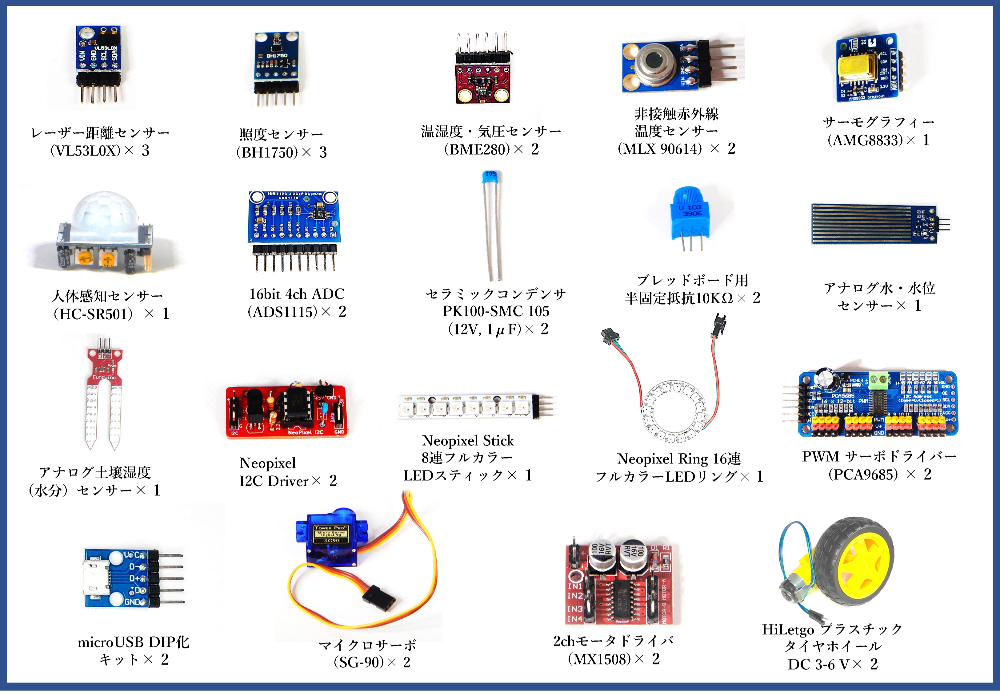
- 応用センサーキットはハッカソン等のアイディアを実装する際に使い勝手の良いセンサーを集めたキットです。
- CHIRIMEN チュートリアルで習得したスキルを使って実際に動作させることが出来ます。
- 一部のセンサーは特性を知る必要があるのでその解説を行います。

# 単体で動作確認できるセンサー
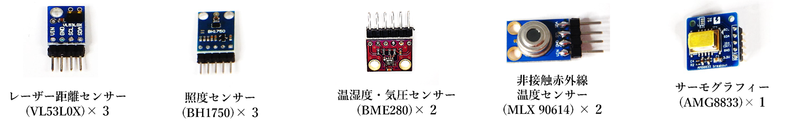
- I2C Examples より回路図とサンプルコードを使って試すことが出来ます。
  - 上記のセンサーのカッコ内はセンサーの型番で、Examples の ID と同じ記載になります。
  - 上記のセンサーはそれぞれ単体で使う事が出来ます。
### 回路図とプログラムサンプル
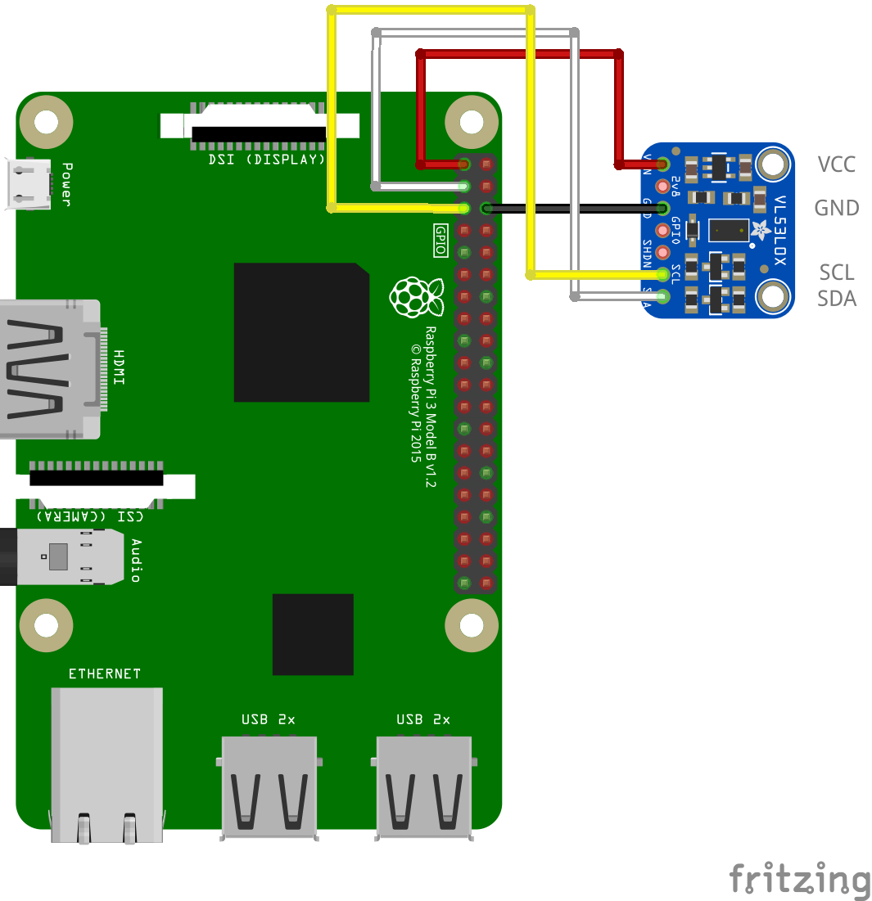
- [PiZero サンプルコード](https://tutorial.chirimen.org/pizero/esm-examples/vl53l0x/main.js)
- 回路図と実物のセンサーは製品によって形状が異なる場合があります。実際の応用センサーキットに入っている距離センサーは下図の物となります。
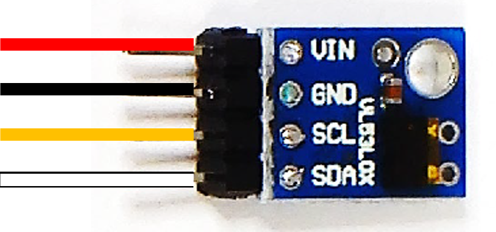
- 写真のレーザーセンサーを基板の表記に合わせた接続例です。同じ色のジャンパーワイヤーで接続します。
- I2C センサーは例の図の基盤に書かれた 4つのピン（VIN / GND / SCL / SDA）を接続するのが基本となります。
```
※注意
回路図のセンサー画像は形は異なっていますが、写真の部品と同じセンサーを示しています。センサーは物により形状が異なる物がありますが搭載されたチップが同じになります。
形状が異なる場合は実物の基板に書かれた文字を確認して、回路図と同じ文字の書かれたピンに接続します。
センサーのピンは接続しない部分も物によってあります。回路図に従って必要な部分を繋ぎます。必ずセンサーの全てのピンを繋ぐ必要はありません。
```

# 人感センサーの使い方
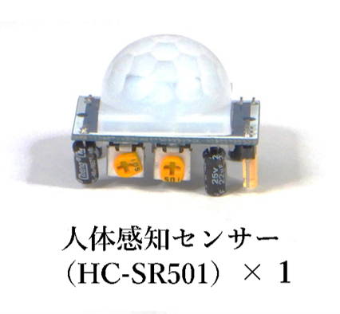
- 人感センサーは半球体の部分から赤外線が発されて人の動きや熱を検知してオンオフするセンサーです。
- 人感センサーは GPIO センサーとなり、チュートリアルのスイッチと同じ種類のセンサーになります。
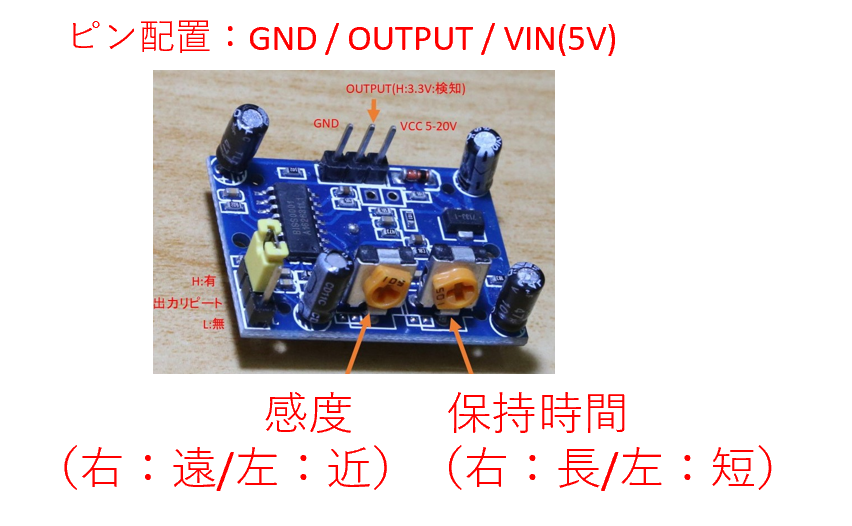
- センサーに感度と保持時間を調整するつまみがあるので調節してテストしてください。
- 人感センサーは広範囲でセンサーが反応しますので、使用者の意図と異なり反応しやすいのでなるべくセンサーから離れて動作確認するようにしてください。
- 動作確認をする際には保持時間を最短にすると調整しやすくなります。
### 回路図とプログラムサンプル
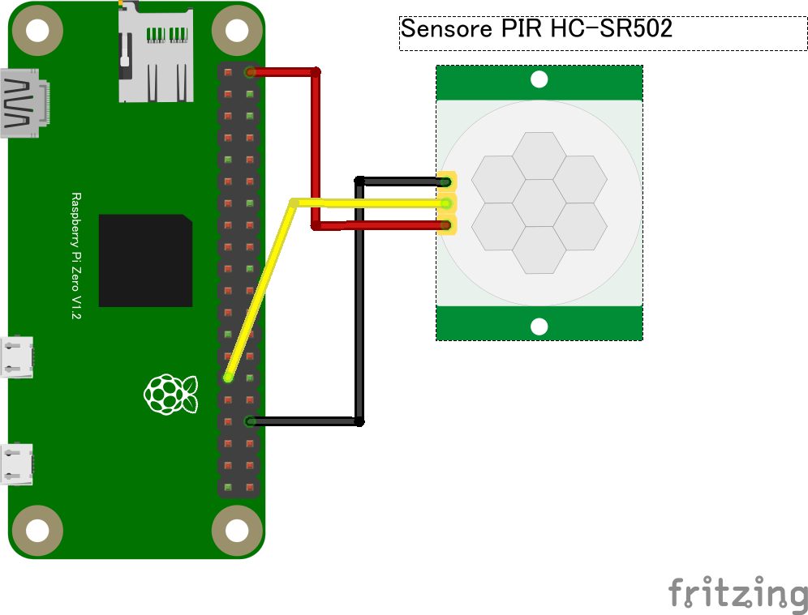
- [PiZero サンプルコード（gpio-onchange と同じ）](https://tutorial.chirimen.org/pizero/esm-examples/gpio-onchange/main.js)
- [（gpio-polling）のサンプルコードも使えます](https://tutorial.chirimen.org/pizero/esm-examples/gpio-polling/main.js)
- [参考情報 ※CHIRIMEN Pi4 版](https://chirimen.org/chirimen/gc/top/examples/#GPIO-pirSensor)
  - サンプルコードは「スイッチ」のソースコードと共通で利用する事が出来ます。人感センサー（pir sensor）の名前でサンプル一覧には掲載されていないので注意してください。
  - 「スイッチ2」のソースコードでも動作させることが可能で、こちらは逐一センサーの状況が分かるので、調整をする際にはこちらのサンプルを利用すると便利です。

# Neopixcel LED の使い方
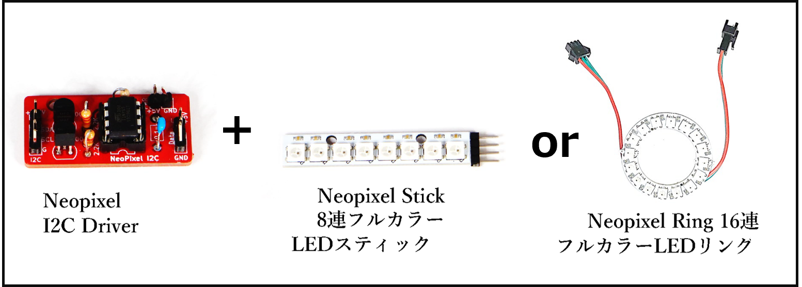
- Neopixcel LED というフルカラーLED の使い方です。こちらの LED はチュートリアルの LED と異なり、プログラムで複数の LED の点灯の制御や色を変えたりすることが出来ます。
- 接続には Neopixcel I2C Driver というオープンハードウェアを利用しています。このドライバーボードは市販品ではありません。
### 回路図とプログラムサンプル
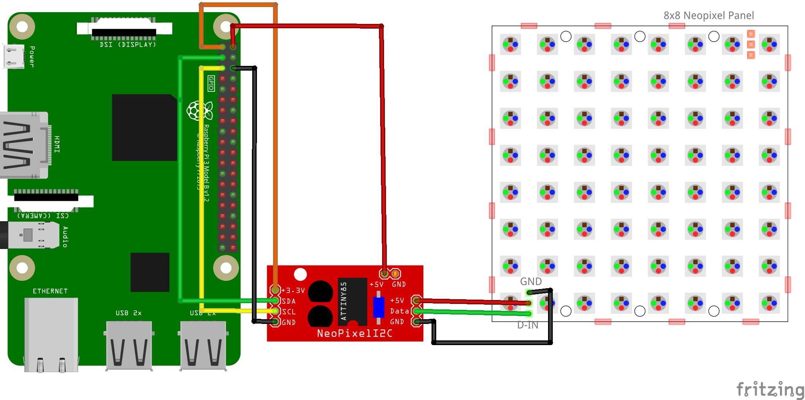
- 専用コントローラーボード Neopixcel I2C Driver を使った接続をすると簡単に使う事が出来ます。
- センサーを使う時には図のように赤色のドライバボードと NeoPixel LED をペアで利用して試してください。
  - Neopixcel LED は様々なサイズ、形で商品が出ています。（丸形、棒型、マトリクス型、テープ型　等）

# アナログセンサーの使い方
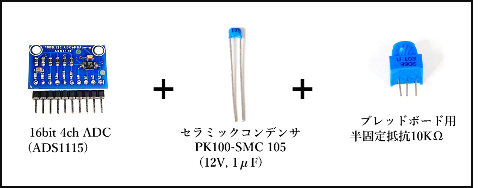
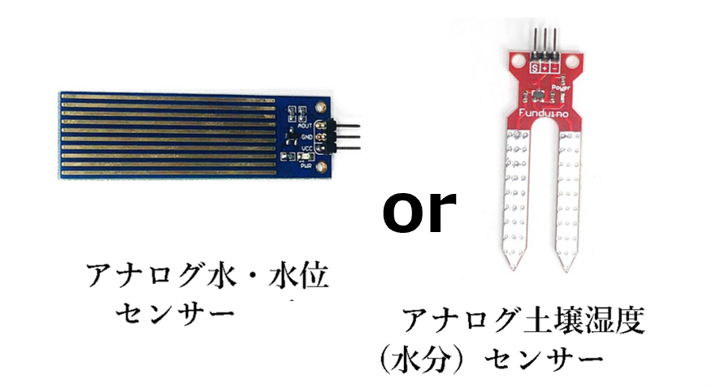
- アナログセンサーを利用する時には ADC（アナログデジタルコンバーター）を利用して値を取得して使います。
- 応用センサーキットでは半固定抵抗（つまみの代わり）を利用したアナログ値の変更の確認をするサンプルと、水位センサー・土壌湿度センサーがキットに含まれています。
### 回路図とプログラムサンプル
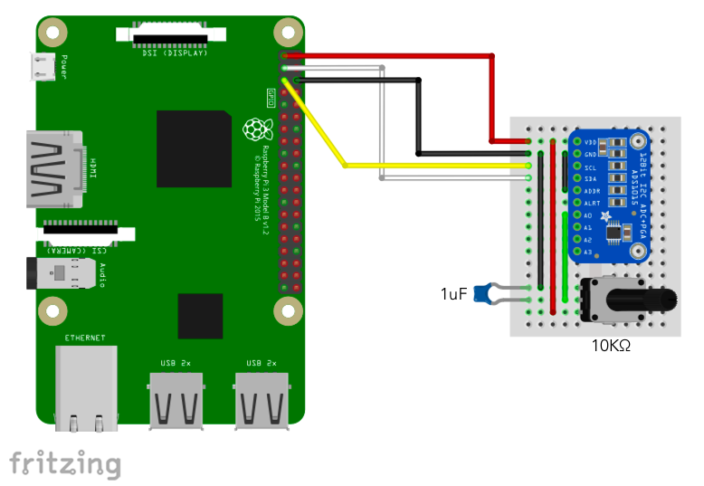
- アナログセンサーの利用は ADS1115 を使います。回路図にあるつまみは半固定抵抗 10KΩ を使用します。
- [PiZero サンプルコード](https://tutorial.chirimen.org/pizero/esm-examples/ads1x15/main.js)
  - サンプルコードはアナログの値を電力に変換して表示させています。
  - 電力変化量から必要な値を求められるようにするのは、プログラムでの計算が必要です。

### 回路図とプログラムサンプル
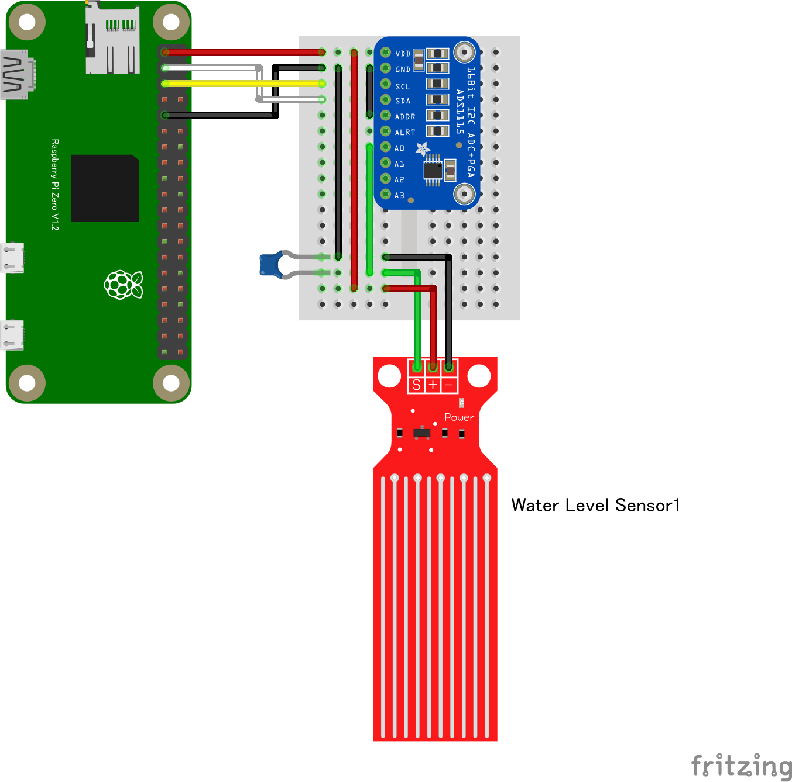
- 水位センサ、土壌湿度センサもアナログセンサーです。ADS1115 を併用して使います。
- [PiZero サンプルコードは上記と同じです](https://tutorial.chirimen.org/pizero/esm-examples/ads1x15/main.js)

# アクチュエーター（サーボモーター）の使い方
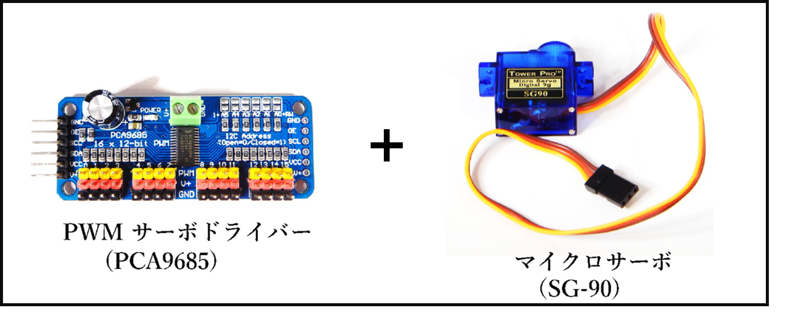
- モーターを使用する場合はモータードライバーを経由して制御します。
- モーターを動かすため外部から電力を取る必要があります。

### 回路図とプログラムサンプル
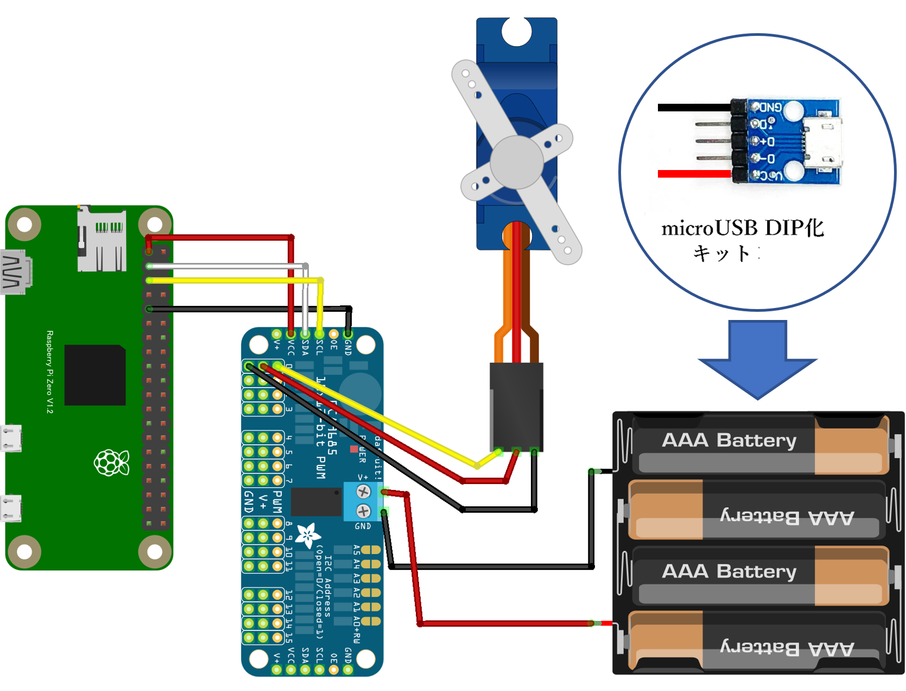
- [PiZero サンプルコード](https://tutorial.chirimen.org/pizero/esm-examples/pca9685/main.js)
- 給電方法は電池ボックス又は USB DIP 化キットを使ったモバイルバッテリーの使用、電源モジュールを使った ACアダプタ給電など

#### PiZero から給電する回路図
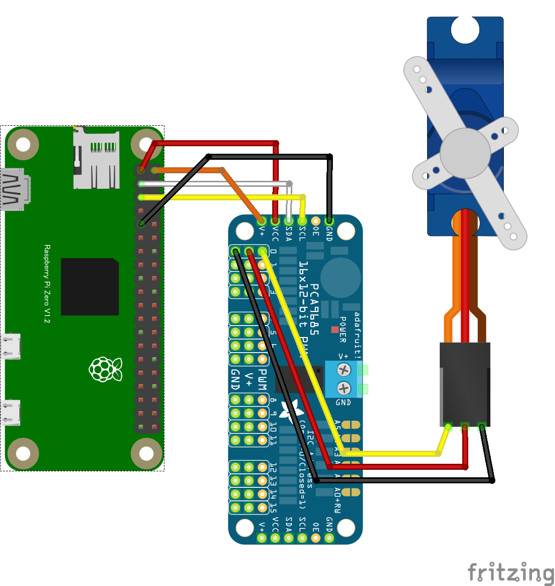
- 低消費電力のモーター（例：SG-90）1個の場合、RasPi Zero からの電力供給でも動作させられるものもあります。
### モバイルバッテリーの利用方法
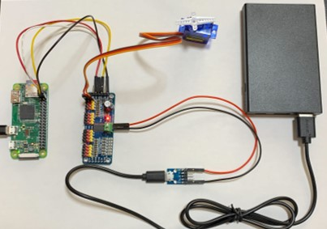
- microUSB DIP化キットを使用してモバイルバッテリーを電池ボックスとして使用する事が出来ます。
- 電源として利用するだけであれば、VIN と GND の 2ヶ所にジャンパーワイヤーを使用して接続が出来ます。

# アクチュエーター（DCモーター）の使い方

- モーターを使用する場合はモータードライバーを経由して制御します。
- モーターを動かすため外部から電力を取る必要があります。

### 回路図とプログラムサンプル
#### hbridge1 の回路図（MX1508利用）
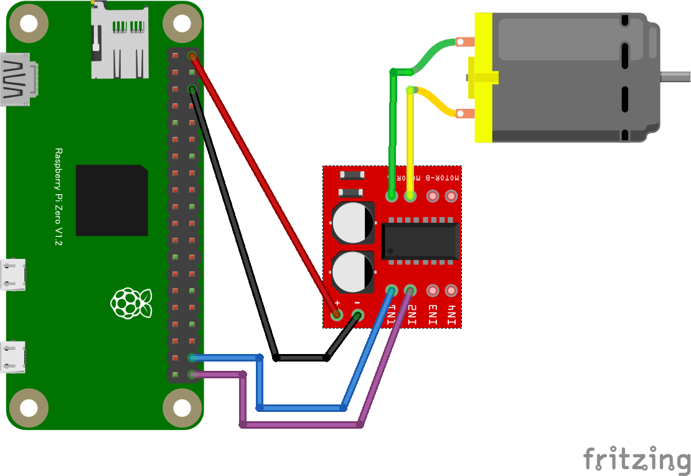
- [PiZero サンプルコード](https://tutorial.chirimen.org/pizero/esm-examples/hbridge1/main.js)
- L298N と同様に動作する MX1508 で接続した回路図を掲載します。
  - モーターの動作にジャンパーワイヤーを巻き込まない様に動作前に接続状況を注意してください。
#### hbridge2-pca9685pwm の回路図（MX1508利用）
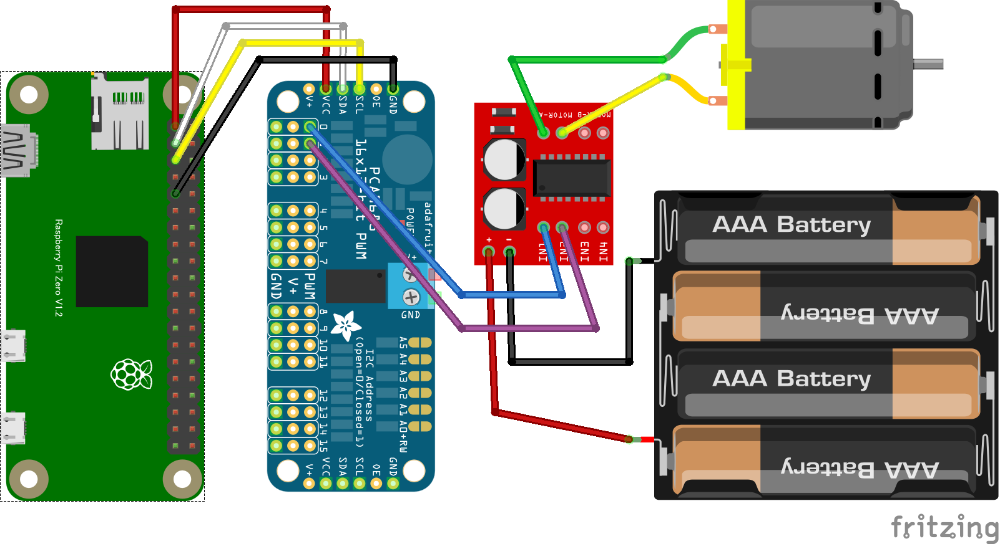
- [PiZero サンプルコード](https://tutorial.chirimen.org/pizero/esm-examples/hbridge2-pca9685pwm/main.js)
- PWMサーボドライバーと組み合わせた動作の場合は、PWM駆動が可能になります。
- モーターの回転速度も PWM で制御できるので加速や減速などを行う事も可能です。
- 電池は USB DIP を使用してモバイルバッテリーに変える事も可能です。
