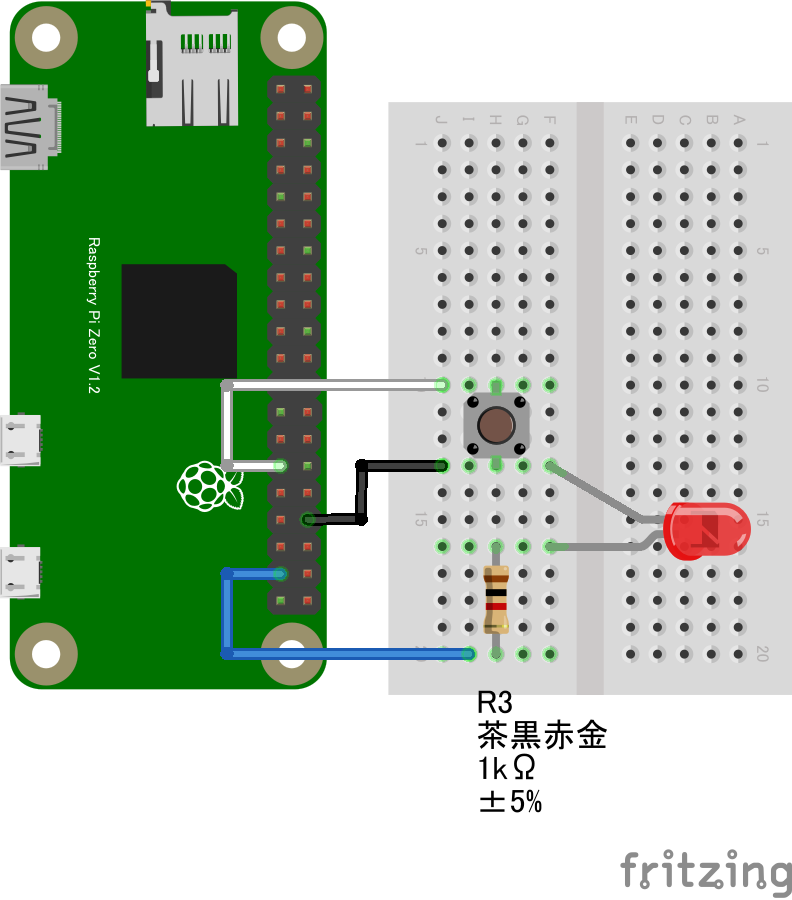

# GPIO を試す
## ボタンで点灯する LED ／ 回転するモーター制御
- LED の点滅制御（Lチカ）から、ボタンで点灯する制御に変更してみましょう。
- 回路図は以下の通りに接続します。LED/モーターのどちらかで動作させることが出来ます。
  - GPIO PORT5にスイッチ、GPIOPORT26に抵抗とLED を繋ぎます


- モーターを使用した際の回路図は以下となります。
  - GPIO PORT5にスイッチ、GPIOPORT26にモーター制御回路を繋ぎます


- Lチカのコードを書き換えて、スイッチで動作する様に変更します。
- 正しく回路を接続し、コードを書き換えたらボタンを押した時に LED やモーターが動作する様になります。
  - 上手く動作しない方は、コピペで動作を確認してみましょう。
- 複数の関数で変数を使用できるように port 変数を宣言しなおします。

```
const sleep = msec => new Promise(resolve => setTimeout(resolve, msec)); 
let port; // port 変数を複数の関数で使えるように宣言

async function blink() {
  const gpioAccess = await requestGPIOAccess(); 
  port = gpioAccess.ports.get(26); // 26 番ポートを操作する、ここの変数は宣言済みなので const は削除する
```

- 無限ループの処理は削除します。

```
  /* ここは削除する
  // 無限ループ
  for (;;) {
    // 1秒間隔で LED が点滅します
    await port.write(1); // LEDを点灯
    await sleep(1000);   // 1000 ms (1秒) 待機
    await port.write(0); // LEDを消灯
    await sleep(1000);   // 1000 ms (1秒) 待機
  }
```

- ボタンの初期化処理を記述します。

```
  const port2 = gpioAccess.ports.get(5);
  await port2.export("in");
  port2.onchange = showPort;
}
```

- ボタンの処理を追記します。

```
function showPort(ev){
	console.log(ev.value);
    if (ev.value==0){
        port.write(1);
    } else {
        port.write(0);
    }
}
```

- 全体のソースコードは以下のとおりとなります。

```
import {requestGPIOAccess} from "./node_modules/node-web-gpio/dist/index.js"; // WebGPIO を使えるようにするためのライブラリをインポート
const sleep = msec => new Promise(resolve => setTimeout(resolve, msec)); // sleep 関数を定義
let port; // port 変数を複数の関数で使えるように宣言

async function blink() {
  const gpioAccess = await requestGPIOAccess(); // GPIO を操作する 
  port = gpioAccess.ports.get(26); // 26 番ポートを操作する、ここの変数は宣言済みなので const 宣言は削除する

  await port.export("out"); // ポートを出力モードに設定

  // ここから記述する
  const port2 = gpioAccess.ports.get(5);
  await port2.export("in");
  port2.onchange = showPort;
}

function showPort(ev){
	console.log(ev.value);
    if (ev.value==0){
        port.write(1);
    } else {
        port.write(0);
    }
}
  // ここまで

blink();
```
