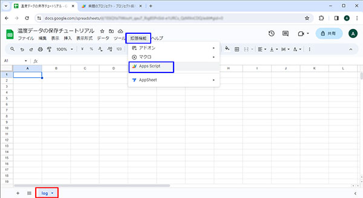
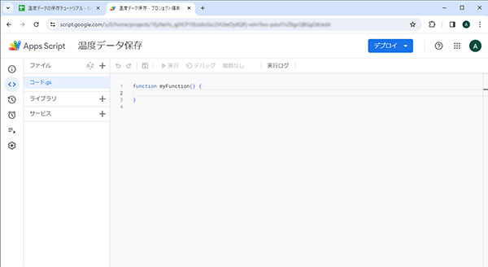
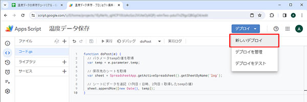
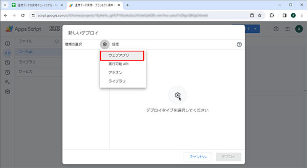
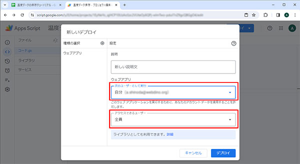
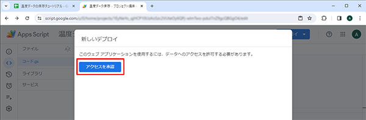
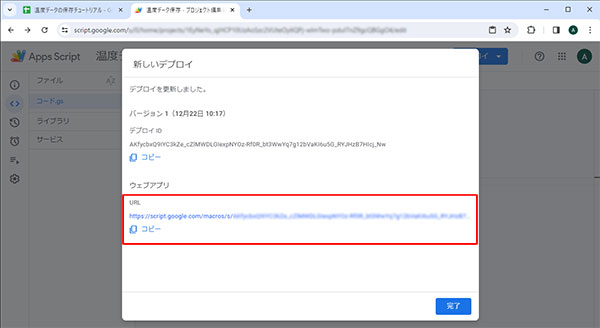
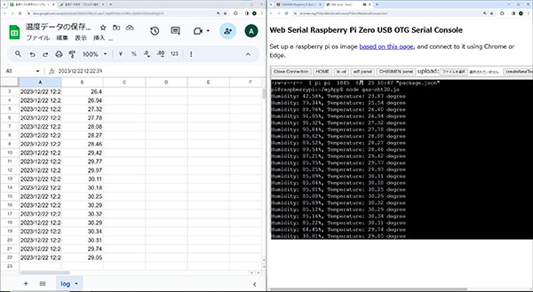

# センサーで取得した温度を GAS に保存する
- CHIRIMEN を使って温湿度センサー（SHT30）で取得した温度データを Google スプレッドシートに保存します。
## Google スプレッドシートの準備
- Google スプレッドシートを新規作成します。
  - シート名を gs で使用するために「log」に変更しておきます。
  - スプレッドシート名は自由に変更してください。
- メニューより［拡張機能］－［Apps Script］を選択します。新しいタブでエディターが開きます。
  - プロジェクト名は自由に記述できます。





- `［コード gs］` ここにコードを記述します。

gs コードサンプル
```
function doPost(e) {
  // パラメータtempの値を取得
  var temp = e.parameter.temp;
  
  // 保存先のシートを取得
  var sheet = SpreadsheetApp.getActiveSpreadsheet().getSheetByName('log');
  
  // シートにデータを追記（1列目：日時、2列目：取得したtempの値）
  sheet.appendRow([new Date(), temp]);
}
```
- コードを記述したら［デプロイ］より、［新しいデプロイ］を選んで実行します。



- 設定ウィンドウが出てくるので設定（ギアのアイコン）から「ウェブアプリ」を選びます。



- 各種設定をしていきます。
  - 説明：適宜入力してください
  - ウェブアプリ
    - 次のユーザーとして実行：自分の Google アカウントを選択
    - アクセスできるユーザー：全員を選択
- 設定を終えたら「デプロイ」ボタンを押します。



- アクセス権の確認が行われるので、「承認」を押します。デプロイが実行されるので完了まで待ちます。



- デプロイが完了したら発行された URL が表示されます。
  - 発行された URL は CHIRIMEN のコードで利用するのでコピーして控えておきます。
  - 後から確認する時は［デプロイ］－［デプロイを管理］から確認出来ます。



## CHIRIMEN のコードを記述して実行する
- [チュートリアルの手順](https://tutorial.chirimen.org/pizero/#section-4)に従ってコードを記述します。
  - `［Create New Text］`より、新規コード作成を行っていきます。
  - チュートリアルでは `gas_sht30.js` というファイル名で作成します。

温度センサーを GAS に保存するコードサンプル
```
import { requestI2CAccess } from "./node_modules/node-web-i2c/index.js";
import SHT30 from "@chirimen/sht30";
const sleep = msec => new Promise(resolve => setTimeout(resolve, msec));

main();

async function main() {
    const i2cAccess = await requestI2CAccess();
    const port = i2cAccess.ports.get(1);
    const sht30 = new SHT30(port, 0x44);
    await sht30.init();

    while (true) {
        const { humidity, temperature } = await sht30.readData();
        
        //データを Google スプレッドシートへ送る※URLは適宜変更してください
        fetch('https://［自分で発行した URL をここに記述する］', {
            method: 'POST',
            body: new URLSearchParams({
                'temp': `${temperature.toFixed(2)}`
            })
        });

        console.log(
            [
                `Humidity: ${humidity.toFixed(2)}%`,
                `Temperature: ${temperature.toFixed(2)} degree`
            ].join(", ")
        );

        // 5秒毎に GAS に温度を記録する
        await sleep(5000);
    }
}
```

## 実行して動作を確認する
- 作成したコードを実行します。温度を取得した後に Google スプレッドシートにも記録されます。
  - 実行は Web Serial Console より `node gas_sht30.js` のコマンド入力で実行します。
  - 実行する時のファイル名は自分で入力したファイル名に置き換えてください


