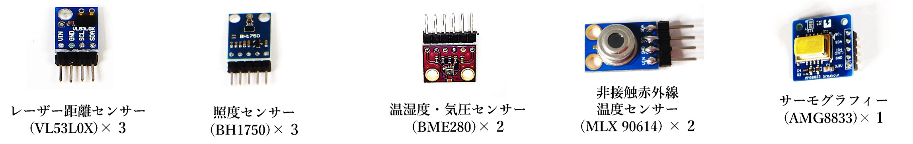
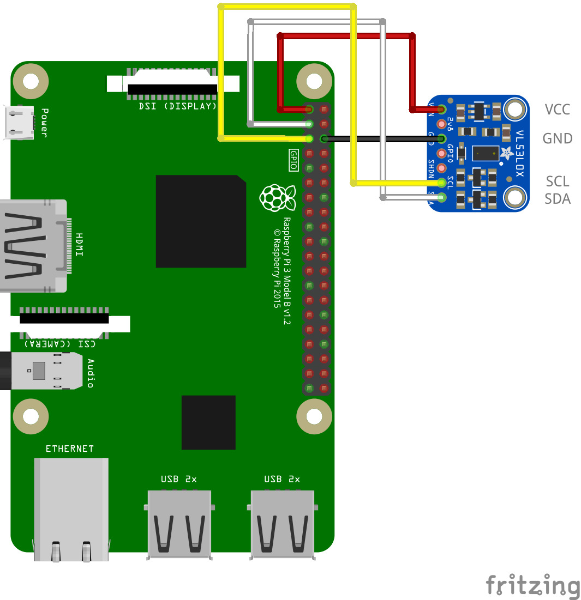

# 単体で動作確認できるセンサー



- I2C Examples より回路図とサンプルコードを使って試すことが出来ます。
  - 上記のセンサーのカッコ内はセンサーの型番で、Examples の ID と同じ記載になります。
  - 上記のセンサーはそれぞれ単体で使う事が出来ます。

### 回路図とプログラムサンプル

 

- [PiZero サンプルコード](https://tutorial.chirimen.org/pizero/esm-examples/vl53l0x/main.js)
- 回路図と実物のセンサーは製品によって形状が異なる場合があります。実際の応用センサーキットに入っている距離センサーは下図の物となります。
- 写真のレーザーセンサーを基板の表記に合わせた接続例です。同じ色のジャンパーワイヤーで接続します。
- I2C センサーは例の図の基盤に書かれた 4つのピン（VIN / GND / SCL / SDA）を接続するのが基本となります。
```
※注意
回路図のセンサー画像は形は異なっていますが、写真の部品と同じセンサーを示しています。センサーは物により形状が異なる物がありますが搭載されたチップが同じになります。
形状が異なる場合は実物の基板に書かれた文字を確認して、回路図と同じ文字の書かれたピンに接続します。
センサーのピンは接続しない部分も物によってあります。回路図に従って必要な部分を繋ぎます。必ずセンサーの全てのピンを繋ぐ必要はありません。
```
