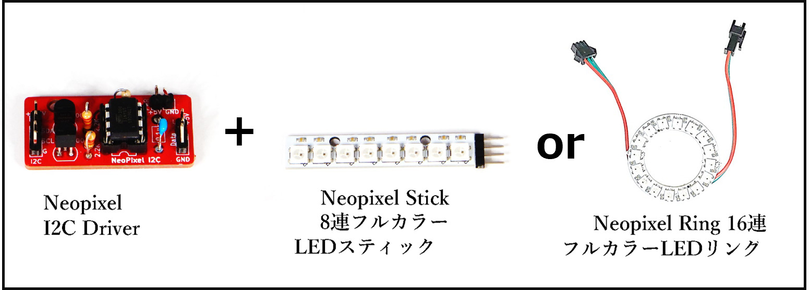
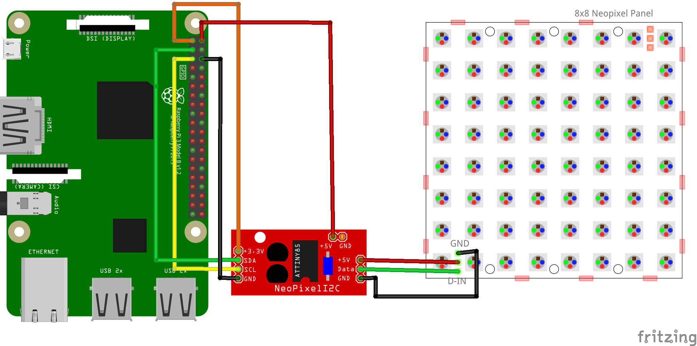

# Neopixel LED の使い方

- Neopixel LED というフルカラーLED の使い方です。こちらの LED はチュートリアルの LED と異なり、プログラムで複数の LED の点灯の制御や色を変えたりすることが出来ます。
- 接続には Neopixel I2C Driver というオープンハードウェアを利用しています。このドライバーボードは市販品ではありません。

### 回路図とプログラムサンプル

動作を確認するためのサンプルコードは `CHIRIMENパネル` から入手できます。 
ブラウザでサンプルコードの中を確認したい場合は `コードを確認する` から確認出来ます。
- NEOPIXEL LED（8連LED／16連LED） ＞ **ID：neopixel-i2c　タイトル：NEOPIXEL LED**
  -  [※コードを確認する](https://tutorial.chirimen.org/pizero/esm-examples/neopixel-i2c/main.js) 

【備考】
- 専用コントローラーボード Neopixel I2C Driver を使った接続をすると簡単に使う事が出来ます。
  - Neopixel I2C Driver は[オープンソースハードで、市販品ではありません。](https://github.com/chirimen-oh/accessories/blob/master/others/neopixel_i2c_TH/)
- センサーを使う時には図のように赤色のドライバボードと NeoPixel LED をペアで利用して試してください。
  - Neopixel LED は様々なサイズ、形で商品が出ています。（丸形、棒型、マトリクス型、テープ型　等）

[応用センサー一覧に戻る](ad_sensor.md)
